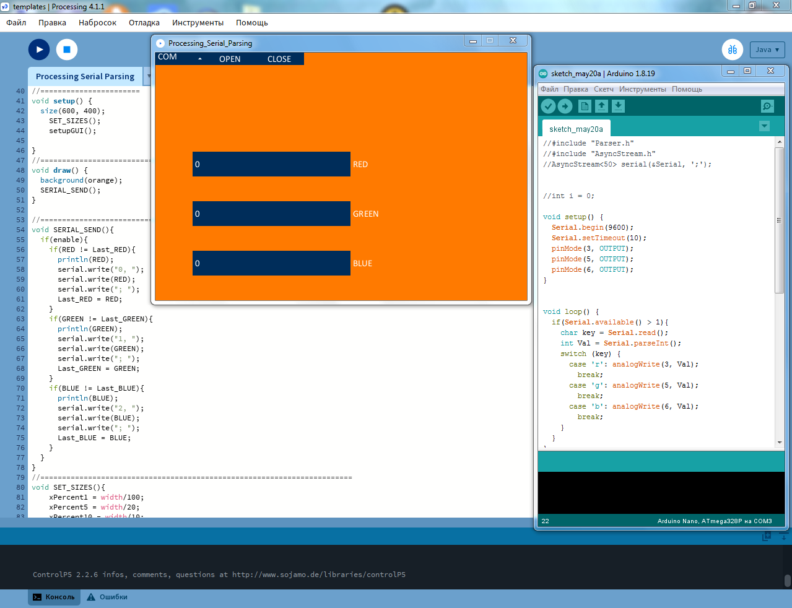

# prototype-processing-rgb-control


A simple GUI application written in Processing (Java) that controls an Arduino RGB LED over a serial connection.

 <!---->

<p align="center">
  
</p>


This project was created in 2022 as one of my early GUI experiments.

It represents the beginning of my desktop application journey:

- Processing (Java) + ControlP5 → .NET Framework 4.7.2 WinForms → .NET 8 WPF → ASP.NET Core + Blazor

Features
- RGB LED control using three sliders
- Serial (COM) port selection
- Open/Close serial connection
- Real-time PWM updates
- Simple Processing GUI using the ControlP5 library

Hardware
- MCU: ATmega328P
- Arduino Uno/Nano compatible board
- RGB LED connected to PWM pins

Software Requirements
Processing IDE
ControlP5 library

Processing download:

https://processing.org/download

Install ControlP5 from:

```
Processing
└── Tools
    └── Manage Tools
        └── Libraries
```

Search for: **ControlP5**

Running
1. Upload the Arduino sketch.
2. Connect the board via USB.
3. Open the Processing sketch.
4. Run the application.
5. Select the correct COM port.
6. Press Open.
7. Move the RGB sliders.

```
Note
The COM port list is populated only during application startup and is not refreshed dynamically.
```

```
Project Structure
processing-serial-parsing_rgb-control/
├── Processing/
│   └── RGB_Control.pde
├── Arduino/
│   └── RGB_Control.ino
└── README.md
```

Learning Notes

This project was primarily an experiment with:

- Processing GUI development
- Serial communication
- Arduino PWM control
- Basic desktop application architecture

Although the code reflects my programming style from 2022, I intentionally keep it unchanged as part of my learning history.

Credits

The Arduino serial parsing ideas were inspired by AlexGyver:  https://alexgyver.ru/lessons/


